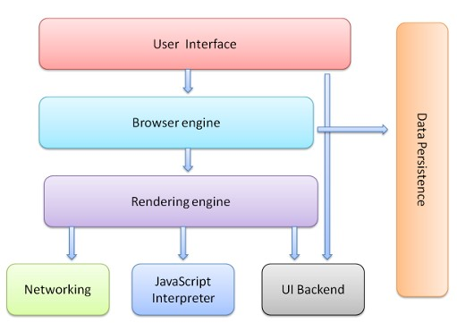
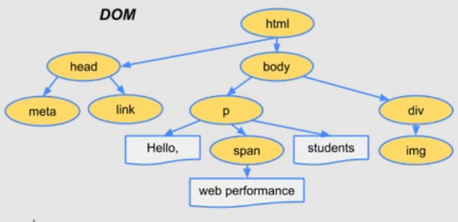

## What is the main functionality of a browser ? ##

A browser uses a URI (Uniform Resource Identifier) and sends requests for data(HTML/CSS/JS/XML/JSON and others) to other nodes(server/another computer) in its network and serve received data to the requested user.

A browser uses multiple protocols (Set of rules) & ports (80 : unsecure & 443 : secure) to send & receive different types of resources in its network and display them in a presentable way to the end-user.

## High Level Components of a browser ##

The important high level components of a browser are as follows:

1. User Interface:

User interface contains the following sub components.
address bar, forward/back buttons, bookmarks, window to show content etc. 

2. Browser Engine:

This works with both rendering engine and user interface to show the final output.
To display non-native files like PDF,DOC etc... browser needs plugins/extensions.

3. Rendering Engine:

This is responsible for parsing HTML, CSS, scripts etc., and displaying them on screen.

4. Networking:

This sends network requests and handles incoming data from other computers (servers) in the network.
The URI is translated into an IP address (exact location of the server that hosts the requested resources) by DNS server. Then the request is sent to that server. 
Port 80 is used by default for unsecure communications.
Port 443 is used for secure connections. 

5. UI Backend:

Used to draw basic widgets like combo boxes and windows that are platform independent.

6. Javascript Interpreter:

It parses JS code and executes it.

7. Data Storage:

This is where data is stored locally for persistence (Eg. cookies)
Browsers support storage mechanisms such as localStorage, IndexedDB, WebSQL and FileSystem

## Rendering Engine and its Use ##

Rendering engine interacts with network layer to get documents(HTML/CSS etc) in chunks of 8kbs.
Thus rendering engine parses HTML and CSS files.
Each html element is convered to DOM node. 
A Content tree/DOM tree containing DOM nodes is thus constructured.

Simultaneously all style data is parsed, and a "Render tree" is created. 
Render tree is made of rectangles with visual attributes and contains the right order in which these are to be displayed.

Then layout/reflow process starts where each node is given exact coordinates of its location.

Finally painting process starts. Here render tree will be traversed and each DOM node will be painted using the UI Backend Layer.

This is how rendering engine works.

Browsers can run multiple instances of rendering engines when new tabs are opened.

As an overview, Rendering Engine does the following: 

1. Processes HTML markup and builds DOM tree.
2. Processes CSS markup and builds CSSOM tree.
3. Combines the DOM and CSSOM into a render tree.
4. Run layout on the render tree to compute geometry of each node.
5. Paint the individual nodes to the screen.

## Parsers (HTML, CSS, etc) , Tree Construction , Layout & Painting ##

HTML parsing involves tokenization for DOM tree construction.
A HTML parser 
    (a) parses every character in the HTML file
    (b) create tokens for each tag, attributes and values.
    (c) create the nodes of DOM Tree from these tokens and mount them

Similar to HTML parsing, CSS parsing also starts by tokenizing the CSS source code into tokens, which are then parsed into CSS rules or... the CSSOM tree is created. After this, layout process starts.

During the layout process, the CSS rules (CSSOM Tree) generated by CSS parser and DOM tree created by HTML parser are combined to generate "render tree"

Finally painting process involves traversing the Render tree with the help of UI Backend layer. 
Thus everything comes together in this step.

DOM Tree (in brief):

The DOM tree represents content of the document.
The tree reflects the relationships and hierarchies between different tags. Tags nested within other tags are child nodes. The greater the number of DOM nodes, the longer it takes to construct the DOM tree.

## Script Processors & Order of Script Processing ##

* When the parser finds non-blocking resources, such as an image, the browser will request those resources and continue parsing.

* Parsing can continue when a CSS file is encountered, but 'script' tags—particularly those without an async or defer attribute—block rendering, and pause the parsing of HTML. Though the browser's preload scanner hastens this process, excessive scripts can still be a significant bottleneck.

* All scripts are parsed & processed sequentially by default.

* Parsing of a document halts until the encountered script has been executed. 

* Parsing also halts until an external script is fetched.

* If 'defer' attribute is used on a script, then the parser will not halt until it is loaded completely. This deferred script is parsed after parsing the document.

* If a script is has "async" attribute, it will be parsed and executed by a different thread.